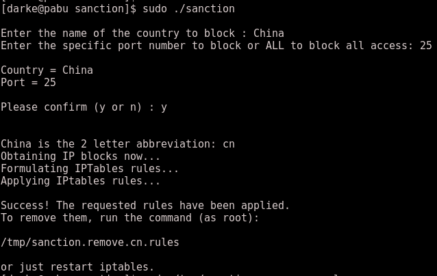

Sanction - to impose a sanction on; penalize, especially by way of discipline. 

===============================================================================

This script is meant to be a quick and effective method to block entire ip 
blocks belonging  to a specific country. You can block a specific port or ban 
the IP outright. If your server has IPset installed, it will use that rather
than IPtables directly (far better performance, so IPset is advised if you
can install it).

Note: Long term network filtering management is better handled by an external 
device (firewall, DoS mitigation services, etc) for a variety of reasons I am 
not going to get into in a README. That said, sometimes you need a quick way 
to stem the tide until you can get those services in place. That's where 
Sanction hopefully comes in.

Example usage:

You will be prompted for the options (or choices) and you will be provided 
with a script to remove the iptables/ipset rules that sanction creates.

In the event more than one country is matched, it will present you a menu
of options.

Any issues, questions, or ideas for improvements can be sent to adarke@gmail.com

Current wishlist: write the iptables rules into their own chain, multiple country
	entries, and setting it up to accept command line parameters rather than
	just interactive.

Changelog:

0.9.4 : ipset support added, if ipset is installed

0.9.3 : Clean up of rule generation.

0.9.2 : Routines for multiple country matches and error checking in place. 
	General clean up of code and pushed to public beta.

